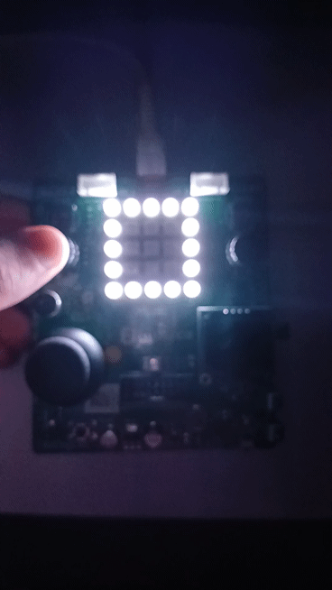

# Tarefa_1_interrupcao

## Descrição Geral

Este projeto tem como objetivo consolidar o entendimento do uso de interrupções em microcontroladores e demonstrar o controle de diferentes tipos de LEDs (comuns e endereçáveis WS2812) utilizando a placa de desenvolvimento BitDogLab com o microcontrolador RP2040. O sistema integra hardware e software para exibir números de 0 a 9 em uma matriz 5x5 de LEDs WS2812 e utiliza botões para a interação do usuário. Além disso, um LED RGB (utilizado, neste exemplo, como indicador vermelho) pisca continuamente, cumprindo as especificações do enunciado.

## Objetivos do Projeto

- **Interrupções e Debouncing:**  
  - Implementar rotinas de interrupção (IRQ) para tratar os eventos dos botões.
  - Corrigir o fenômeno de bouncing dos botões via debouncing por software.

- **Controle de LEDs:**  
  - Manipular e controlar uma matriz 5x5 de LEDs endereçáveis WS2812.
  - Utilizar um LED RGB (pelo menos o canal vermelho) para fornecer feedback visual através de um efeito de piscar.

- **Configuração de Hardware:**  
  - Utilizar resistores de pull-up internos para os botões de acionamento.
  - Integrar os componentes na placa BitDogLab para um projeto funcional que combine hardware e software.

## Componentes Utilizados

- **Placa BitDogLab / RP2040:**  
  Microcontrolador utilizado para gerenciar o sistema e executar as rotinas de interrupção.

- **Matriz de LEDs WS2812 (5x5):**  
  Conectada à GPIO 7, esta matriz exibe números (0 a 9) utilizando padrões fixos (estilo digital ou criativo).

- **LED RGB:**  
  Utilizado para efeitos visuais, com seus pinos conectados às GPIOs 11, 12 e 13. Neste projeto, o canal vermelho é programado para piscar continuamente 5 vezes por segundo.

- **Botões de Acionamento:**  
  - **Botão A:** Conectado à GPIO 5, incrementa o número exibido na matriz.
  - **Botão B:** Conectado à GPIO 6, decrementa o número exibido na matriz.

## Funcionalidades do Projeto

1. **LED Indicador Pisca:**  
   - O LED vermelho do LED RGB pisca continuamente 5 vezes por segundo, fornecendo um feedback visual constante.

2. **Interação via Botões:**  
   - Ao pressionar o **Botão A** (GPIO 5), o número exibido na matriz de LEDs é incrementado.
   - Ao pressionar o **Botão B** (GPIO 6), o número exibido é decrementado.
   - O tratamento do bouncing dos botões é feito via software, garantindo leituras estáveis.

3. **Exibição de Números:**  
   - Os LEDs WS2812 são usados para criar efeitos visuais que representam os números de 0 a 9.
   - Cada número é exibido em um formato fixo na matriz.

## Descrição do Funcionamento

- **Configuração Inicial:**  
  O sistema inicializa o PIO (Programmable I/O) com o programa específico para controle dos LEDs WS2812 e configura os pinos dos botões (com pull-up interno) e o LED RGB (pino de saída).

- **Mapeamento e Atualização do Display:**  
  - Uma matriz de referência define a posição física dos LEDs na matriz 5x5.
  - Padrões predefinidos para os números de 0 a 9 são armazenados e, conforme o valor atual, o frame correspondente é enviado para o buffer dos LEDs.
  - O display é atualizado de forma sincronizada com as interrupções geradas pelos botões.

- **Tratamento de Interrupções e Debouncing:**  
  - As rotinas de interrupção são configuradas para os botões, permitindo a detecção imediata dos eventos.
  - Um mecanismo de debouncing (delay de 200ms) evita leituras errôneas devido ao bouncing dos botões.

- **Feedback Visual:**  
  - O LED vermelho pisca continuamente, indicando que o sistema está ativo e funcionando conforme o esperado.

## Requisitos Técnicos e Organização do Código

- **Uso de Interrupções:**  
  Todas as interações com os botões são gerenciadas por meio de rotinas de interrupção, seguindo os requisitos do projeto.

- **Debouncing:**  
  O código implementa um mecanismo de debouncing via software para garantir a confiabilidade da leitura dos botões.

- **Controle de Diferentes LEDs:**  
  O projeto demonstra o controle tanto dos LEDs endereçáveis (WS2812) quanto de um LED RGB comum.

- **Estruturação e Comentários:**  
  O código está organizado em funções bem definidas, com comentários em blocos explicativos para facilitar a compreensão e manutenção do projeto.

## Compilação e Execução

1. **Pré-requisitos:**  
   - Instalar o SDK do Raspberry Pi Pico e configurar o ambiente de desenvolvimento.
   - Certificar-se de que todas as bibliotecas e arquivos (como `ws2812.pio.h`) estejam corretamente instalados.

2. **Compilação:**  
   - Vá na extensão raspberry pi pico do vscode e aperte a oppção de importar projeto e selecione essa pasta do projeto.
   - Aperte em compilar no botão inferior do seu vscode.

3. **Upload para a Placa BitDogLab / RP2040:**  
   - Conecte a placa ao computador via USB.
   - Faça o upload do firmware compilado para a placa (por exemplo, copiando o arquivo UF2 para o dispositivo montado).
   - Ou aperte run na parte inferior do seu vscode, caso esteja configurado para desenvolvimento em raspebrry pi.

## Demonstração:

<video width="320" height="240" controls>
  <source src="demonstracao.mp4" type="video/mp4">
  Seu navegador não suporta o elemento de vídeo.
</video>

## Considerações Finais

Este projeto integra conceitos importantes de sistemas embarcados, como interrupções, debouncing e controle de diferentes tipos de LEDs. Ele oferece uma base sólida para o desenvolvimento de aplicações interativas utilizando a placa BitDogLab e o microcontrolador RP2040, servindo tanto como exercício prático quanto como demonstração de habilidades em hardware e software.

